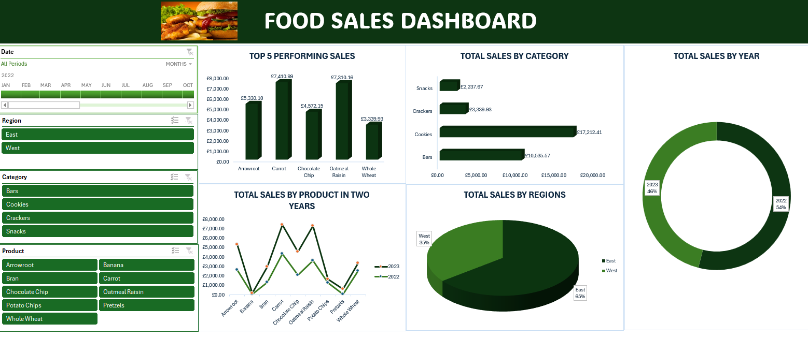
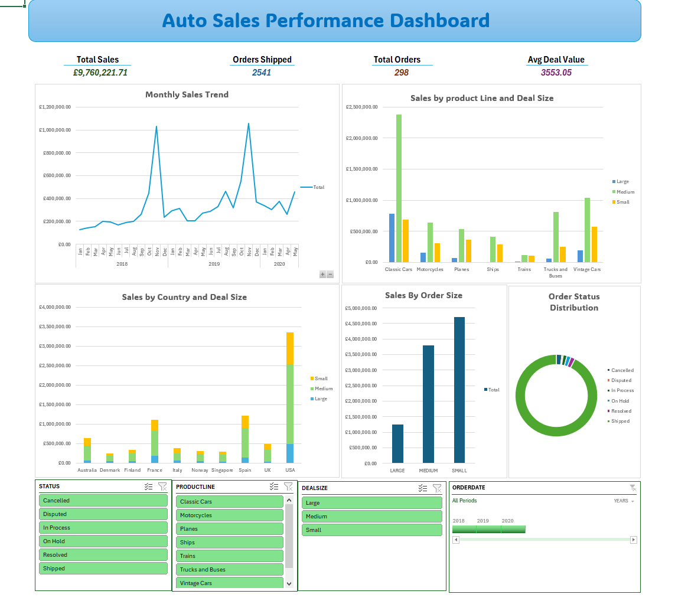
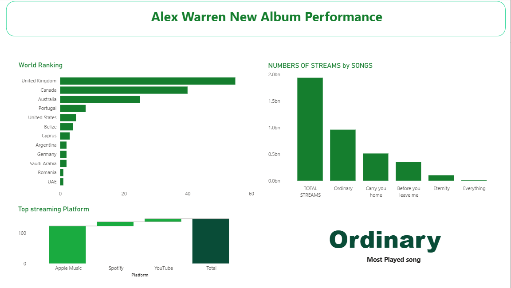
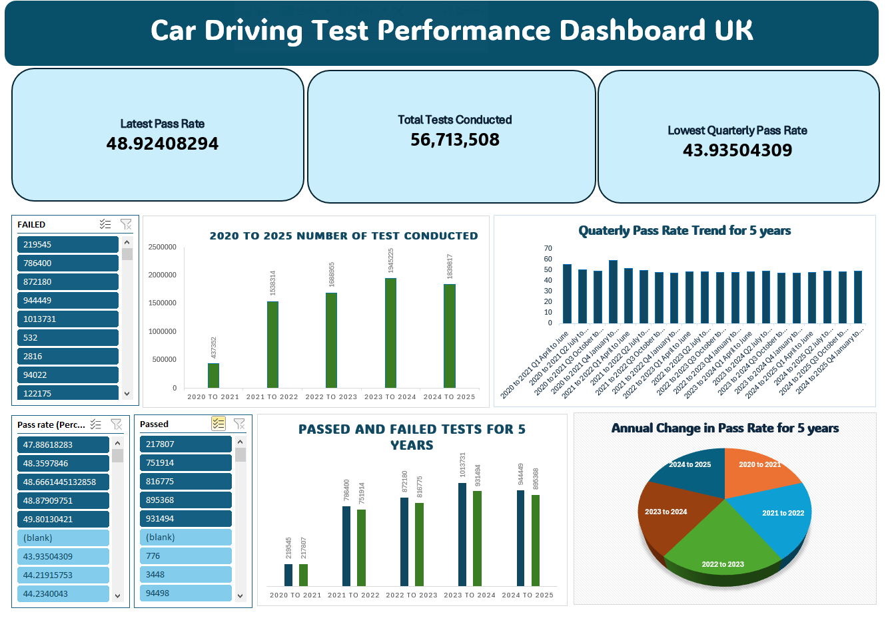

# Project 1 Microsoft Excel

**Title:** [BURGER KING FOOD SALES UNITED STATES](https://github.com/Dominion1987/Dominion1987.github.io/blob/main/FOODFILE.xlsx)

**Tools Used:** Microsoft Excel- Pivot Table, PivotChart Analysis, Conditional Formatting, Data Validation, Slicers, Timeline, and Filter

**Project Description:** This projecy involved analysing product data of a Food company to identify trends and patterns in sales performance for 2022 to 2023. It is designed to provide a comprehensive overview of key performance metrics. This dashboard allows stakeholders to easily monitor and analyze the company's performance across different regions, Cities, products and time periods. the dashboard includes the following features of the sales trends, total sales by product, sales by region etc.

**Key findings:** Top 5 performing food items: Visual representation of the best product the stockholders should look out for profitability.
Sales performance by category: The category break down the provide insights into sales in each category.
Sales Trend: Highlights the total sales across the product and the years for between 2022 and 2023 for the stockholders to have a better decision moving forward.
Sales performance bt regions: this is a careful break down of sales between the east and west region.
Total sales by product in two years:Highlights the total sales generated in year, showcasing the performance in different markets.

**Dashboard Overview:** 

# Project 2 SQL Server

**Title:** Sales Record- SQL Data Manipulation and Interogation

**SQL Code:** [Sales Records SQL Codes](https://github.com/Dominion1987/Dominion1987.github.io/blob/main/Sales_Record.sql)

**SQL Skills Used:**
Data Retrieval (SELECT): Queried and extracted specific information from the database.
Data Aggregation (SUM, COUNT): Calculated totals, such as sales and quantities, and counted records to analyze data trends.
Data Filtering (WHERE, BETWEEN, IN, AND, GROUP BY, ORDER BY, HAVING): Applied filters to select relevant data, including filtering by ranges and lists.
Data Source Specification (FROM): Specified the tables used as data sources for retrieval

**Project Description:**
In order to arrange, examine, and display sales data for a company, this project entails building and maintaining a sales record database. The objective is to create a solid SQL-based system that can store important sales data, guarantee data accuracy, and provide sensitive analysis for well-informed decision-making.
Database Design: Creation of tables for products, customers, sales transactions, and sales representatives and establishment of relationships between tables using primary and foreign keys.
Data Management: Insertion, updating, and deletion of sales records and implementation of constraints to maintain data integrity.
Query Implementation: Customer segmentation analysis based on purchase history and trend analysis for sales performance over time.
Reporting:Generating reports for management, including sales trends, revenue growth, and regional performance.

**Technology used:** SQL server

# Project 3 Microsoft Excel

**Title:** [Auto Sales Performance Dashboard](https://github.com/Dominion1987/Dominion1987.github.io/blob/main/AutoSalesdataDashboard.xlsx)

**Tools Used:** Microsoft Excel- Pivot Table, PivotChart Analysis, Conditional Formatting, Data Validation, Slicers, Timeline, Filter, and Bricks ai software

**Project Description:** This project provides a comprehensive overview of auto sales data, highlighting revenue trends, product line performance, deal sizes, and order status distribution. Use it to understand key sales metrics, identify top-performing categories, and monitor operational efficiency across products and geographies.

**Key Findings:** 
1. Sales show strong seasonal spikes in November 2018 and November 2019, with monthly sales exceeding $1 million in both months.
2. There is a consistent mid-year sales dip around May each year, followed by a gradual increase.
3. A consistent upward sales trend occurs between Q3 and Q4 annually, indicating a reliable year-end surge.
4. Medium-sized deals generate the highest sales across most product lines, with Classic Cars leading at £2.38 million in medium- sized deals.
5. Classic Cars lead overall sales across all deal sizes, particularly excelling in medium-sized deals.
6. Trains have minimal sales in large deals, suggesting limited capacity or niche demand for high-value train orders.
7. The USA dominates total sales with over $3.3 million, primarily driven by medium-sized deals totaling $2.05 million.
8. Spain and France are the next largest markets, each generating around $1.05 million and $1.12 million respectively, significantly less than the USA.
9. Australia, the UK, and Italy have balanced sales distributions across small, medium, and large deal sizes, with no single deal size dominating.

**Dashboard Overview:**

# Project 4 Power BI

**Title:** Alex Warren New Album Performance

**Tools Used:** PowerBI- Power Query Editor, Data Model, DAX (Data Analysis Expressions), Visualization Pane, Filters and Slicers, Tiles, Dashboard Layout and Bricks ai software.

**Project Description:** This dashboard provides a comprehensive analysis of Alex warren new album performance showing the world ranking, numbers of streaming of songs and top streaming platform.

**Key Findings:** 
1. Album Rankings – Alex Warren’s latest album debuted at #1 in the UK, #2 in Canada, #3 in Australia, and #4 in the US.
2. Release Performance – Released on July 18, 2025, the album has already surpassed 1.9 billion streams across all platforms.
3. Platform Breakdown – The most streamed platforms are Apple Music and Spotify, with standout track performances:
Ordinary – 962.8M streams
Eternity – 102.9M streams
Before You Leave Me – 354M streams
Carry You Home – 513.4M streams
4. Top Song – Ordinary is currently the most played song in Alex Warren’s catalogue at the time of this post

**Dashboard Overview:**

# Project 5 Microsoft Excel

**Title:** [Car Driving Test Performance in the UK](https://github.com/Dominion1987/Dominion1987.github.io/blob/main/Car_Drivingtests_Great_Britain.xlsx)

**Tools Used:** Microsoft Excel- Pivot Table, PivotChart Analysis, Conditional Formatting, Data Validation, Slicers, Timeline, Filter

**Project Description:** This dashboard provides a comprehensive analysis of car driving tests conducted in the UK, focusing on quarterly and yearly trends in the number of tests conducted, pass and fail counts, and pass rates. It enables users to monitor changes over time, identify key performance indicators, and spot anomalies or periods of significant change in test outcomes. The dashboard is designed to support data-driven decision-making and highlight long-term patterns as well as recent developments

**Key Findings:** 
1. The total number of tests conducted From 2020 to 2025 the Covid 19 year 2020 to 2021 been the lowerest test conducted with 437,352 and increased in 2023 to 2024 with 1,945,225, Currently at 1,839,817 in 2025
2. Quarterly test volumes have remained relatively stable between 450,000 and 470,000 tests, except for a notable spike to 560,000 tests in the fourth quarter of 2023.
3. The annual change in pass rate for the pass 5 years has been stable with 20% in each year.
4. The Pass and Fail test for the pass 5 years has been a little different with 51% pass rate and 49% failed.

**Dashboard Overview:**

